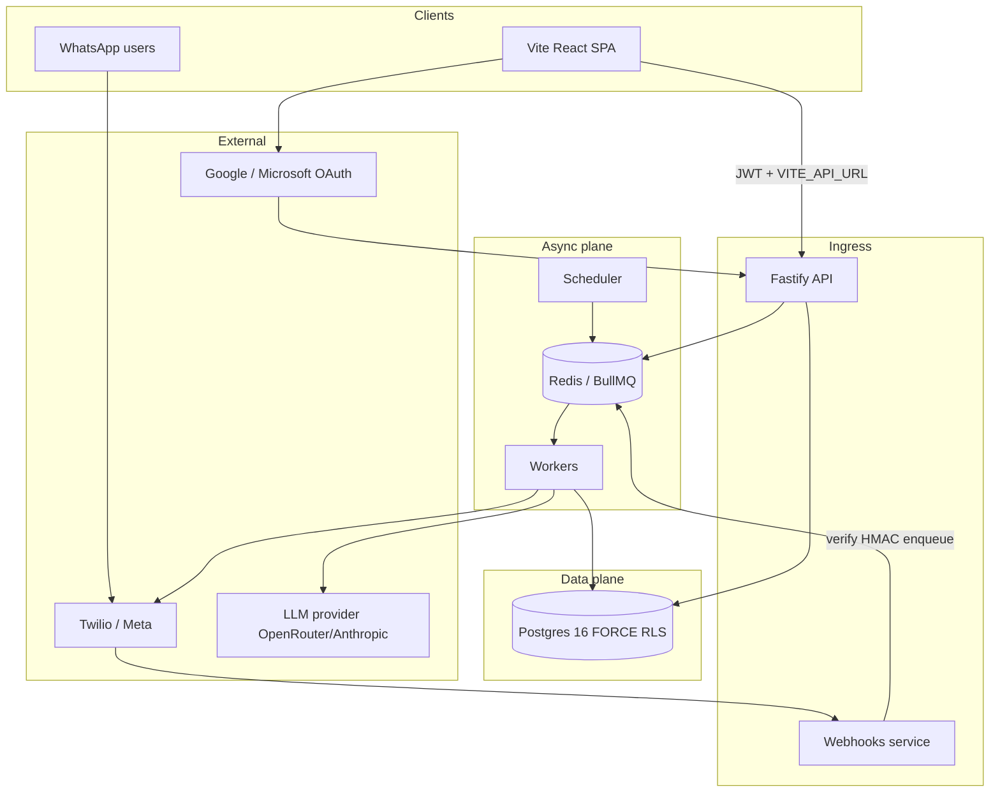

# Loop — Comprehensive System, Product & Engineering Report

**Document type:** Master technical and product handbook (PDF source)  
**Edition:** Loop v3 · ProDG Studios pilot (Nairobi, Kenya)  
**Classification:** Internal — engineering, product, legal, and operations  
**Primary sources:** `docs/design/` (product shape), `docs/buildguide/` & `docs/spec/` (C-1–C-7 law text, deep schema, historical enterprise build), `docs/audit/AUDIT.md` (forensic baseline 2026-08-24), `docs/DECISIONS.md` (implementation lock), `docs/compliance/`, `docs/ops/`, and the live monorepo under `apps/`, `packages/`, `src/`.

---

# Instructions for Claude (PDF authoring & gap-fill)

You are producing a **heavy professional PDF** (target **60–100+ pages**) from this markdown and from the repository’s design/build documentation. This is not a slide deck and not an executive one-pager. It is a **deeply logical, technical engineering and product report** suitable for a technical team that must understand *why* Loop exists, *what* it is, *how* it is built, *how* data protection is enforced, and *what remains* before public go-live.

## Tone and density (mandatory)

1. Write in **continuous analytical prose** — full paragraphs with causal reasoning. Do **not** produce pages that are mostly short bullet lists with large empty white space.
2. Tables are allowed when they encode matrices (authz, retention, queues, routes). Every table must be preceded by at least one explanatory paragraph stating *why the table matters* and followed by interpretation where needed.
3. Prefer **argument → evidence → implication** over slogans. When citing law (EU AI Act, GDPR, Kenya DPA, Meta WhatsApp), state the constraint, then the product consequence, then the enforcement point (DB / middleware / worker / UI), then the test that proves it.
4. Preserve mermaid diagrams as figures with captions. Expand them into prose walkthroughs.
5. Distinguish clearly three layers of truth:
   - **Design contract** (`docs/design/`) — what must be true.
   - **Audit finding** (`docs/audit/AUDIT.md`, 2026-08-24) — what was true at inspection.
   - **Current codebase** — what has been remediated since (A0/A1 cutover, authz middleware, Postgres plane, etc.). Never collapse these into one false “fully done” claim.

## Gap-fill mandate (critical)

Claude (or a prior agent) authored substantial build/design documentation. **You must actively fill gaps**, not merely typeset this file. Before finalizing the PDF:

1. Read (or request) these companions and **merge any material missing from this handbook** into the appropriate chapter:
   - `docs/design/00_OVERHAUL_BRIEF.md` through `11_BUILD_ORDER.md`
   - `docs/buildguide/00_START_HERE.md` §0.2 (C-1–C-7 full legal text)
   - `docs/buildguide/01_ARCHITECTURE.md` through `12_BUILD_PHASES.md` (services, queues, schema depth, WhatsApp tiers, surveys, security)
   - `docs/buildguide/02_DATA_MODEL.md` / `packages/db/migrations/0001_init.sql` (table-level detail)
   - `docs/compliance/*.md` (DPIA, LIA, AI data handling, sub-processors)
   - `docs/ops/PRODUCTION.md` and `docs/ops/runbooks/*`
   - `docs/DECISIONS.md` and `docs/audit/AUDIT.md`
2. If the build docs specify a control, schema column, template key, queue, page control, or launch blocker **not covered here**, **add a new subsection** rather than omitting it.
3. If design and buildguide conflict, **design wins on product shape**; **buildguide wins on verbatim C-* legal language** unless design restates it harder (measurement rule §0.6).
4. Do **not invent** fake completion (“fully production ready”) or fake certifications (SOC 2 achieved, Meta approved). Mark unknowns as open risks.
5. Add an appendix **“Gaps Claude filled from build docs”** listing every substantive addition you made beyond this source file, with the source path.

## PDF structure

- Title page, revision history, table of contents, list of figures/tables.
- Body chapters matching Parts I–XII below (you may renumber when merging gaps).
- Appendices: full C-1–C-7 text, retention table, template registry, route inventory, launch checklist, glossary, gap-fill log.
- Footer every page: *Loop is not a performance-evaluation system · C-1 / EU AI Act Annex III*.
- Typography: 10–11pt body, justified or flush-left with comfortable leading; headings hierarchical; code/SQL in monospace; avoid sparse “one sentence per page” layouts.

---

# Part I — Executive framing and product definition

## 1.1 What this document is for

This report exists so a technical team can share one mental model of Loop: the business problem, the product thesis, the legal envelope, the architecture, the data model, the user-facing system, the messaging and AI pipelines, the enforcement strategy for data protection, the build history (including why an overhaul was required), and the remaining path to a defensible ProDG pilot launch. It is deliberately long. Brevity that omits enforcement detail is how the 2026-08-24 audit found controls that were declared in policy files and absent from request paths.

Loop is a multi-tenant B2B work-coordination system. Its one-sentence job, locked in the v3 overhaul brief, is:

> **Loop makes waiting visible, and shortens it.**

That sentence is not marketing fluff. It is a design filter. Features that do not help someone see what is waiting, understand what that waiting costs, or get the work moving are out of scope. The same sentence also excludes an entire category of “people analytics” product that would be both legally high-risk under the EU AI Act and operationally self-defeating (measurement that feels attributable to individuals gets gamed, and gamed data is worthless).

## 1.2 The founding friction (why the object is waiting, not tasks)

The project began from a concrete failure mode in knowledge work: a data request that took five calendar days, of which roughly two hours were actual productive work. The remainder was **queue time** — waiting on people, unclear ownership, and invisible handoffs. A conventional commitment tracker would have recorded a single task (“share SharePoint usage data”) with a due date and a status colour. That framing answers the wrong question. It asks whether someone is “behind,” which invites watermelon reporting (green outside, red inside). The correct framing asks: when did the item enter a waiting state, who held it, how many **working** days elapsed, and did anyone with authority to unblock it get told?

Loop v2 (the pre-overhaul specification) was still essentially a commitment tracker with a WhatsApp nag bot attached. The forensic audit of 2026-08-24 found that roughly 35–45% of the intended enterprise product was usable, and almost all of that usability lived in a clickable SPA mock — not in a durable multi-tenant production spine. More importantly, the audit found that the product was the **wrong shape**: it measured tasks and statuses, while the operations literature and the founding friction both point at **queues**. The overhaul (Loop v3, documented under `docs/design/`) therefore changes the data model, the hero screen, the check-in questions, the escalation design, and the weekly report. It also changes the engineering culture around controls: every control must be enforced in the request path and proven by a test that fails when the control is removed.

## 1.3 Three continuous questions the product must answer

| # | Question | Why it is operationally primary | Primary surfaces |
|---|----------|--------------------------------|------------------|
| 1 | What is waiting, and on whom? | Work that has started but is blocked consumes calendar time invisibly; managers chase people instead of queues. | `/waiting`, `/flow`, waiting register APIs |
| 2 | How long has it been waiting, and what is that costing? | Wall-clock lies across weekends; without cost-of-delay bands, every item looks equally urgent. | Working-time library, CoD bands, fever charts, flow metrics |
| 3 | Who can unstick it, and have they been told? | Visibility without notification recreates status meetings. | `unblock_request`, escalation ladder, ownership map |

Everything in the design corpus is supposed to serve one of these three. If a proposed feature cannot be mapped to one of them, it should not ship.

## 1.4 What Loop is not (and why that matters commercially)

Loop is not a task tracker in the Asana/Jira sense. It is not a status-report generator that industrializes optimistic green. It is not a performance-evaluation or HR analytics system. It is not a general-purpose WhatsApp chatbot. These exclusions are not aesthetic preferences:

- **Task trackers** optimize for completeness of task lists; Loop optimizes for visibility of delay in work already in motion.
- **Status systems** invite watermelon behaviour; Loop asks for observable facts and derives state.
- **Performance systems** trigger EU AI Act high-risk obligations and destroy data quality through gaming (see Part III).
- **General AI chat on WhatsApp** is barred by Meta’s Business Solution terms as of 15 January 2026 for general-purpose bots; Loop must remain a purpose-specific work-coordination assistant.

## 1.5 Pilot customer and go-to-market wedge

The pilot customer is **ProDG Studios** in Nairobi, Kenya. The default coordination mode for that shape of organization is **`mutual_adjustment`**: informal, peer-to-peer, high WhatsApp reachability. Kenya’s Data Protection Act and ODPC registration obligations apply to the pilot (C-7). The product’s cross-industry expansion path is not “add more industry templates”; it is **`coordination_mode`**, a tenant-level setting derived from organizational configuration theory (Mintzberg’s coordination mechanisms). A 40-person architecture practice and a 40-person marketing agency often coordinate similarly; a 40-person architecture practice and a 40-person payments operations team do not. Mode changes check-in cadence, register (tone), escalation routes, aging thresholds, survey topics, extraction aggressiveness, and vocabulary (for example, replacing “overdue” with “past committed date” in professional practices).

## 1.6 Non-goals locked for v3

Individual performance scores or rankings; emotion/mood/wellbeing inference; voice/video/biometric processing for emotion; custom roles beyond Member/Manager/Admin/Owner; native mobile apps (responsive SPA + WhatsApp as mobile surface); Slack/Teams as check-in *channels* (they may be ingestion sources later); self-serve billing; general-purpose WhatsApp chat; Gantt charts and per-task deadlines as the planning primitive (buffers replace them); pie charts, donuts, and gauges.

---

# Part II — Problem analysis in depth

## 2.1 Queues as the root cause of slow knowledge work

Unmanaged, invisible queues are a primary cause of slow knowledge work. Organizations typically manage timelines and utilization instead of queue length. Queue length is a **leading** indicator; cycle time is a **lagging** one. A product that only reports cycle time reports history. A product that reports queues reports the future — what will miss its commitments unless someone intervenes now.

In practice, waiting appears in several flavours that must not be collapsed into a single “blocked” status: waiting on an internal colleague, waiting on an external client or vendor, waiting on a decision (not a task), and waiting on another commitment. Each flavour routes differently. v2’s collapse into generic blocked status forced escalation logic to guess via keyword ownership maps. v3 models four waiting states explicitly so routing can be deterministic.

## 2.2 The watermelon problem (largest data-quality threat)

The largest threat to Loop’s data quality is not extraction accuracy. It is that people rationally report green when things are red, because in most organizations a red status triggers scrutiny while green is cheaper. A WhatsApp bot that asks “how’s it going?” collects watermelons by default and at scale. v2’s flagship check-in led with a due date, asked for a self-assessed status, and put the blocker question second and open-ended — maximizing the cost of admitting trouble.

v3’s antidote is three design commitments, fully specified in conversation design:

1. **Never ask for a status.** Ask for observable facts (“what’s the last thing that moved on this?”). Facts are harder to shade than colours.
2. **Make waiting the cheapest answer.** One tap; confirmation that the system will chase on their behalf; the reporter must experience help arriving, not attention arriving.
3. **Corroborate against objective signals** (artifact appeared, meeting happened, dependency closed). Divergence flags the **item** for human look. It never produces a per-person accuracy score — that would recreate attributional measurement.

## 2.3 Attributional measurement and Austin’s finding

v2 correctly removed individual performance scores because of the EU AI Act. The operations literature says the constraint is wider than the law. Under partial supervision — every knowledge-work setting — measurement produces dysfunction when people optimize the observable dimension at the cost of the unobservable ones. Critically: **measurement intended purely as information becomes dysfunctional as soon as people perceive it as attributable to them.** Intent is irrelevant; perception is the mechanism.

Therefore the product rule is not merely “do not score people.” It is:

> No screen, export, API response, or report may present a metric that a reasonable employee would read as being about them rather than about the work.

Allowed: “This item has been waiting 6 days”; “3 items are waiting on the data team.” Forbidden: “Kayode has 3 overdue items” as a personal judgement; “Kayode responds to 60% of check-ins”; leaderboards; sorting a team directory by performance-adjacent columns; “last check-in response” as a directory column. The team page still exists, but it shows **work location in a person’s queue** so a manager can help — not a judgement of the person.

## 2.4 Why dual data planes were an existential engineering problem

The audit did not merely find missing features. It found **four sources of truth** coexisting: (1) Vite SPA mock / localStorage, (2) Supabase `org_id` PostgREST plane with RLS ENABLE but not FORCE, (3) Fastify in-memory Maps, (4) an unused-but-correct Drizzle `tenant_id` schema with FORCE RLS. Treating these as one product produced false confidence: UI demos looked complete while the production spine was hollow; isolation tests asserted SQL text offline or `expect(hasDb).toBe(true)` without executing cross-tenant queries; compliance attestation lived in localStorage so clearing the browser cleared the legal record; WhatsApp STOP lived in an in-memory Map so a process restart resurrected consent.

The consolidation decision is therefore mandatory, not optional: **one plane — Postgres with `tenant_id`, FORCE RLS, accessed only through tenant-scoped database helpers.** Auth identity may remain on Supabase Auth; Loop issues its own session JWT carrying `tid` and `role`. PostgREST as a data path is frozen/archived. The SPA `db.*` layer becomes a typed API client. Mock survives only in development/test, and production builds refuse to boot on mock without `VITE_API_URL`.

---

# Part III — Binding legal and platform constraints (C-1 through C-7)

These constraints come from binding law and platform policy. Violating any one creates legal exposure or gets the product banned from a platform it depends on. The full legal prose lives in `docs/buildguide/00_START_HERE.md` §0.2; Claude must paste or faithfully paraphrase that full text into the PDF appendix. What follows is the engineering-facing restatement with enforcement implications.

## 3.1 C-1 — Work coordination, not performance evaluation

Under EU AI Act Annex III §4(b), AI systems used to monitor and evaluate worker performance or behaviour, or to make decisions on promotion or termination, are high-risk, triggering Articles 9–15 obligations. Annex III §4(c) covers real-time monitoring of emotional or behavioural states.

**Product consequences:** No individual performance score, ranking, rating, or league table anywhere — UI, reports, API, or database. Reports describe work items and projects, never people’s competence. Org-level flag `high_risk_use_prohibited` defaults true and is not disableable via UI. Endpoints that would return per-person aggregate scoring are blocked (`forbidden` routes / `assertNoPerformanceScore`). Terms of Service must state that customers using Loop as the basis for promotion, discipline, or termination become deployers of a high-risk AI system with independent obligations.

**Enforcement:** shared guards, API forbidden routes, `no-personal-metrics.spec.ts` walking report JSON, team page column allowlist in design §8.10.

## 3.2 C-2 — No emotion inference on individuals

EU AI Act Article 5(1)(f) prohibits inferring emotions of a person in the workplace (narrow medical/safety exceptions). Penalties are severe. Loop builds to the safe side: never process voice, video, or physiological data for emotion; meeting audio is transcribed and discarded; sentiment only on text the employee deliberately submitted; only in aggregate; **minimum n = 5**; no endpoint returns sentiment keyed to `user_id`; individual sentiment labels purged at aggregation.

## 3.3 C-3 — Lawful basis, DPIA, prior notice

Employee consent is generally not a valid primary basis for workplace monitoring (EDPB). Operative basis is typically legitimate interest (Art. 6(1)(f)) with documented balancing test; DPIA under Art. 35 is mandatory before systematic monitoring. Some member states require works council consultation.

**Product consequences:** Onboarding cannot complete until compliance attestation is recorded in **`tenant_compliance` (database)**. Every employee sees a transparency notice and must acknowledge before processing; ack stored in **`users.notice_acknowledged_at`**. Tenants in `provisioning` cannot invite, connect integrations, or send messages — middleware, not UI. `/settings/my-data` is mandatory. DPIA and LIA templates ship in `docs/compliance/`.

## 3.4 C-4 — Reader ≠ actor (prompt injection)

Loop reads untrusted content, holds private data, and can communicate externally — Willison’s “lethal trifecta.” Prompt injection is not solved by prompt hardening.

**Architecture:** The extraction model that sees untrusted content has no tools, no network, and no ability to trigger actions. Output is JSON validated against a strict schema. Recipients are never taken from model output; phone/email/user IDs resolve from the database by ID. No free-form model text is sent externally; WhatsApp uses pre-approved templates with DB-bound variables. Deterministic sanitization precedes the model. Extraction runs inside per-source context boundaries.

## 3.5 C-5 — Gmail / restricted scopes and CASA

Gmail read uses restricted OAuth scopes requiring annual CASA assessment before production at scale. Email ingestion is Phase 7 / feature-flagged (`FEATURE_EMAIL_INGESTION`), returns 501 when off, and is not on the launch critical path. Narrowest read-only scopes; never send/delete scopes.

## 3.6 C-6 — WhatsApp permissioned channel

Meta requires pre-approved templates for business-initiated messages, explicit opt-in, tiered daily caps (starting ~250 unique contacts/24h for unverified businesses), and a 24-hour service window for free-form replies. Quality rating drops with high block/opt-out rates. General-purpose AI chatbots are barred from the Business Solution; purpose-specific assistants remain permitted.

**Product consequences:** Template registry; rate-limited outbound queue; durable opt-in/out; window tracking; auto-throttle above ~2% opt-out; refuse open-domain chat; HELP/STOP/START command handling; messaging modes `live` | `in_app` | `sandbox` (sandbox not in production builds).

## 3.7 C-7 — Kenya Data Protection Act / ODPC

Loop registers with ODPC as a **data processor** before pilot go-live. ProDG registers as **controller** if it meets employee/turnover thresholds. Follow ODPC DPIA guidance. Prefer documented single region for pilot data. Kenya’s sensitive personal data definition is broad — another reason exclusion filters default to blocking HR/medical/personal-life content before fetch.

## 3.8 The enforcement rule (overarching)

Every control must be enforced in the request path, at the lowest layer that can enforce it, and proven by a test that fails when the control is removed. Database constraint > RLS > API middleware > handler > UI. UI checks are conveniences and must have server-side twins. CI requirements include: `can()` called by middleware for bound routes; tenant context from verified token never from body; isolation suite seeding two tenants and asserting zero leak on SELECT/UPDATE/DELETE against real Postgres.

---

# Part IV — Solution architecture

## 4.1 Target one-plane architecture



| Layer | Choice | Hard rule |
|-------|--------|-----------|
| Frontend | Existing Vite SPA (`src/`) | No business autonomy in the browser; re-point `db.*` to API |
| API | Fastify `apps/api` | Never LLM, outbound WhatsApp, or long jobs in request path — enqueue and return |
| Workers | BullMQ `apps/workers` | All extract/send/report/housekeeping |
| Webhooks | `apps/webhooks` | Verify then enqueue; tenant from registered identifier |
| Scheduler | `apps/scheduler` | Per-tenant timezone fan-out, not global UTC-only crons |
| DB | `packages/db` Postgres 16 | FORCE RLS; `loop_app` has no BYPASSRLS |
| Shared | `packages/shared` | `can`, flow math, working time, coordination profiles |
| AI | `packages/ai` | Reader → validator → persist; actor separate |
| Messaging | `packages/messaging` | Templates + eligibility + Twilio |

## 4.2 Service responsibilities and queues

The API service answers interactive questions quickly. The worker plane owns side effects. Queues (from enterprise architecture, still the target spine):

| Queue | Purpose | Notes |
|-------|---------|-------|
| `ingest` | Transcripts, calendar, email | Exclusion filter before fetch |
| `extract` | LLM extraction | Reader has no tools |
| `classify` | Inbound reply classification | Confidence threshold → clarify once |
| `outbound-whatsapp` | All WhatsApp sends | Global throughput cap; eligibility gate |
| `escalate` | Escalation evaluation/dispatch | Unblock-before-escalate |
| `survey` | Survey gen/dispatch | Admin approve questions |
| `report` | Weekly compute + PDF + email | SQL numbers; model headline only |
| `housekeeping` | Retention, token refresh, health | Nightly retention is real enforcement |

Idempotency via Redis SETNX; DLQ per queue. Missing Twilio credentials in `live` mode must fail loudly — never silently mint `INAPP-*` SIDs that convince operators a message was sent.

## 4.3 Tenancy and isolation model

Default isolation is **pooled** multi-tenant Postgres: every tenant-scoped table carries `tenant_id`; policies use `tenant_id = current_setting('app.current_tenant_id')::uuid`; RLS is **FORCE** so even table owners cannot bypass when using the app role. Tenant context is set transaction-locally via `set_config(..., true)` inside `withTenantContext` / `getTenantDb`. Unset context must return zero rows (fail closed). Enterprise path supports `isolation_tier = 'silo'` with dedicated connection routing.

**Webhook tenant resolution (never body fields):**

| Provider | Resolution |
|----------|------------|
| WhatsApp / Twilio | `To` number → `messaging_numbers` → tenant; then `From` → user **within that tenant only** |
| Fathom | Opaque per-tenant `/webhooks/fathom/:webhookId` stored on `connections` |
| Email (later) | Same opaque path pattern |

CI greps for `body.tenantId` / `body.orgId` and fails the build on matches outside tests. Signature verification is unconditional; missing secret → 503.

## 4.4 Why the browser autonomy engine was deleted (design)

`EngineContext` running check-in/escalation sweeps in an open browser tab is a demo artifact: it only runs while a tab is open; two tabs double-fire; it diverges from server logic; it cannot be audited. Replacement is scheduler-driven sweeps with a read-only AutonomyPill in the SPA and an optional rate-limited admin “run sweep now” API.

## 4.5 Local developer plane and environments

| Service | Typical local port |
|---------|-------------------|
| SPA | 5173 |
| API | 3001 |
| Postgres | 5433→5432 |
| Redis | 6380→6379 |

| Environment | Intent |
|-------------|--------|
| Development | Local compose; mock SPA only when API URL unset and not production build |
| **Staging** | Near-production stack (real Postgres/Redis, real-ish secrets, synthetic + dedicated ProDG staging tenant). Used to verify deploys, migrations, Meta/Twilio configuration, and isolation before production. No real customer personal data unless explicitly contracted. |
| Production | Fail closed on secrets, mock plane, unsigned webhooks; live messaging only with explicit `messaging_mode=live` and configured Twilio |

Demo credentials documented for operators: `alfred@prodg.studio` / `LoopDemo2026!` — must never be passwordless login outside DEV/test.

## 4.6 Repository map (post-consolidation intent)

```
apps/api, apps/workers, apps/webhooks, apps/scheduler
packages/shared, packages/db, packages/ai, packages/messaging
src/          # SPA
docs/design/  # product SoT
docs/buildguide/, docs/spec/  # historical + C-* law
docs/compliance/, docs/ops/, docs/audit/
```

---

# Part V — Domain model and flow engine

## 5.1 Commitments as flow objects

A commitment (item) is work owed between parties. In v3 its primary descriptor is **`flow_state`**, not a marketing status colour. The authoritative history is **`flow_events`**: append-only rows recording from_state, to_state, waiting-on, duration_seconds, working_seconds, source, and actor. `commitments.flow_state` is a denormalized cache of the latest event for list performance. **Every metric derives from `flow_events`, never from the cache alone.** Writes to cache and events happen in one transaction.

## 5.2 State machine

| State | Meaning | Clock contribution |
|-------|---------|-------------------|
| `proposed` | Extracted, not confirmed | Not counted |
| `ready` | Confirmed, owned, not started | Queue age |
| `active` | Work happening | Touch / working time |
| `waiting_internal` | Blocked on internal person | Waiting |
| `waiting_external` | Blocked on external party | Waiting |
| `waiting_decision` | Blocked on a decision | Waiting |
| `waiting_dependency` | Blocked on another item | Waiting |
| `review` | Owner claims done; awaiting accept | Waiting |
| `done` | Accepted | Stop |
| `cancelled` | Not happening | Excluded |

Event sources: `checkin` | `manual` | `extraction` | `system` | `corroboration`.

## 5.3 Working time (non-negotiable library)

All durations use `workingSecondsBetween` in `packages/shared`, parameterized by tenant timezone (default `Africa/Nairobi` for pilot), work days, quiet hours, and `tenant_holidays`. An item blocked Friday 17:00 and unblocked Monday 09:00 waited **zero** working seconds. Reimplementing duration via timestamp subtraction in a page or worker is a defect. Public holidays are edited at organization settings and seeded for Kenya for the pilot — never inferred.

## 5.4 Cost of delay

Loop cannot compute true economic cost of delay without business context it does not have. It uses four human-set bands with weights 8/4/2/1 (critical/high/standard/low). Bands are set at project level and overridable per item; **never invented by a model**. Items that block other open items are auto-promoted one band while dependencies remain open, with UI explanation. CoD × working age orders the waiting register, check-in priority under daily message caps, and escalations.

## 5.5 Committed dates vs due dates

`due_date` semantics are replaced by `committed_date`: exists only when someone actually committed with another party. Models never produce dates. Most items have no date and are ordered by CoD and age. This removes a major source of false “overdue” nagging that would cause muting.

## 5.6 Project buffers and fever charts

Critical-chain style protection: aggregate buffer at project level; monitor buffer consumption against chain completion. Chain completion is CoD-weighted; **waiting never advances completion**. Zones: green/amber/red/unknown. Unknown means insufficient signal (no fake green). Buffer may be fixed by admin or derived from observed waiting with method disclosed in UI.

## 5.7 Hero metrics

Waiting now (team-days); longest wait; flow debt trend versus prior week; unblocked this week. These replace count-based dashboard cards (open/at-risk/overdue counts) as the primary signal.

## 5.8 Waiting register

The highest-value operational screen: every item in waiting_* or review, ordered by CoD × working age, groupable by holder or by project. External holders are free-text names because much consultancy delay sits outside the tenant’s user table.

## 5.9 Coordination modes (behaviour matrix summary)

Five modes: `mutual_adjustment`, `direct_supervision`, `standardized_process`, `standardized_outputs`, `standardized_skills`. Each mode changes check-in strategy (periodic vs exception-only vs boundary-only), register/tone, who is asked, escalation trigger and route, aging amber/red days, survey topics, extraction aggressiveness, and vocabulary. Implementation is a single profile module; **no consumer hardcodes thresholds**. Snapshot tests must show the same fixture commitments produce materially different schedules/routes/report sections across modes. `standardized_skills` has hard rules: never nudge professionals about the conduct of their own work; track only cross-boundary obligations; escalate to coordinators; avoid the word “overdue.”

## 5.10 Schema domains (enterprise Postgres)

Control: `tenants`, `tenant_compliance`, `tenant_settings`, `tenant_flags`, `tenant_holidays`. Identity: `users`, `teams`, `team_members`, `invites`, `sessions`, `identity_connections`. Work: `projects`, `milestones`, `commitments`, `commitment_events`, `flow_events`. Ingestion: `connections` (encrypted token bytea), `ingestion_exclusions`, `meetings`, `source_messages`. Messaging: templates, conversations, messages, quota, messaging_numbers, message_approvals. Escalation: `ownership_map`, `escalations`. Surveys: cycles, questions, responses (no user_id FK — respondent hash), aggregates (CHECK min n≥5). Reporting: reports, recipients, deliveries. AI/safety: `ai_runs`, `injection_events`. Compliance ops: `audit_log`, `dsr_requests`.

Claude should expand this section from `0001_init.sql` and design §04 with column-level notes where they affect product behaviour (opt-in/out timestamps, visibility arrays, review_required, fever columns, coordination_mode).

---

# Part VI — Conversation, messaging, and anti-watermelon design

## 6.1 Check-in structure

Outbound check-ins ask a factual question and offer three taps: Waiting on someone / I’m on it / It’s done, plus free text. No due-date lead, no “how’s it going,” no status vocabulary. Waiting branch collects who/what, sets waiting state, acknowledges chase. Active branch acknowledges and reschedules. Done branch lightly corroborates and moves toward review/done. Free text goes through classifier; confidence below 0.7 yields one clarifying question then stop — never loops.

## 6.2 Vocabulary discipline

Replace “overdue,” “you’re late,” “blocked” (as personal failure), “status,” “why hasn’t this been done,” “failed to respond,” and “performance” with neutral work-centric phrasing. Escalations name items and waiting relationships, never “Alfred says Kayode is blocking him.”

## 6.3 Template registry

All business-initiated WhatsApp messages are utility templates with variables bound only to database values. Keys include OTP, check-in variants, waiting follow-ups, acknowledgements, clarify, unblock_request, escalation notify/ack, resolved notify, survey invite, standup prep, opt-out confirm, and mode-specific formal variants. Claude must pull the full registry table from `docs/design/05_CONVERSATION.md` §5.5 into the PDF.

## 6.4 Escalation ladder

Prefer `unblock_request` to the holder before escalating. Escalation routes depend on coordination mode. Stop messaging after the third escalation on an item. “Take this” reassigns ownership. Manual escalations from UI show route preview before send.

## 6.5 Eligibility, opt-out durability, modes

Eligibility requires opt-in, not opted-out, notice acknowledgement, quiet hours compliance, and quota/tier headroom. STOP/UNSUBSCRIBE paths write `whatsapp_opt_out_at` **synchronously** before further enqueue; cancel queued jobs; send one confirmation. Restarts must not resurrect consent. Modes: `live` (real Twilio, fail loud), `in_app` (My-work delivery, UI discloses WhatsApp off), `sandbox` (admin outbox, excluded from production builds). Auto-throttle tenants with elevated opt-out rates.

## 6.6 Nudge quality

Collect YES/NO nudge feedback on a sample of sends. Track precision per trigger; auto-suspend below 0.70; surface at `/settings/nudge-quality`. This is how the system learns without building a performance score about people.

---

# Part VII — Identity, authorization, and pages

## 7.1 Roles

Four roles only: Member, Manager, Admin, Owner. Authorization is expressed as actions in `packages/shared` (`can()` / policies) and enforced in API middleware (`requireBoundAction` / `bindRoute` preHandler). Unknown actions fail closed. UI role gates mirror the matrix but are never sole enforcement.

## 7.2 Authorization matrix (normative)

| Action | Member | Manager | Admin | Owner |
|--------|:------:|:-------:|:-----:|:-----:|
| View/update own items and check-ins | ✅ | ✅ | ✅ | ✅ |
| Flow/waiting self scope | ✅ | ✅ | ✅ | ✅ |
| Flow/waiting team scope | — | ✅ | ✅ | ✅ |
| Org-wide flow | — | — | ✅ | ✅ |
| Create projects/milestones | — | Own team | ✅ | ✅ |
| Reassign, manual check-in, escalate | — | Own team | ✅ | ✅ |
| Review confirm/reject | — | Own team | ✅ | ✅ |
| Invite users; set roles (not Owner grant) | — | — | ✅ | ✅ |
| Routing, governance, coordination | — | — | ✅ | ✅ |
| Approve survey questions | — | — | ✅ | ✅ |
| View reports | — | Team | ✅ | ✅ |
| Audit, retention, DSR admin | — | — | ✅ | ✅ |
| Export all data, delete org, billing | — | — | — | ✅ |

No role can retrieve a per-person performance metric because none exists.

## 7.3 App shell and information architecture

Sidebar order: Flow · Waiting · My work · Projects · Items · Review (manager+) · Escalations · Team (manager+) · Reports (manager+) · Surveys (admin+) · Integrations · Settings. Top bar: tenant, notifications, avatar menu, AutonomyPill. Banners for broken connections, unverified WhatsApp, provisioning (non-dismissible), suspended nudge triggers. Mobile: Flow · Waiting · My work · More.

## 7.4 Route catalogue (design contract)

Public auth and recovery routes; invite token acceptance; onboarding sequence (organization → compliance → coordination → notice → profile → WhatsApp → connections → exclusions → routing → people → complete); hero `/flow` and `/waiting`; `/my-work` merging personal dashboard and inbox; projects with Flow tab; commitments with flow timeline; review with “Might be stale”; escalations; team without personal metrics; surveys; reports; integrations; notifications; settings including coordination, routing, governance, messaging, nudge-quality, compliance, security, billing, and launch readiness.

Claude must expand each major page from `docs/design/08_PAGES.md` with the control tables (type, label, enabled rules, handler, confirm, success/error) — those tables are the UX contract. Cross-check `src/App.tsx` for currently implemented paths and note deltas (e.g. ownership-map path naming, missing onboarding steps, `/surveys/current` guard status).

## 7.5 Page deep-dives (summary; expand in PDF)

**`/flow`:** Scope switcher; four hero metrics; needs-decision list; aging scatter; waiting preview; fever grid; WIP advisory. Partial failure isolation per panel. Empty states distinguish new vs healthy tenants.

**`/waiting`:** Full register with group/sort/filter; nudge/escalate/reassign/not-waiting; batch nudge; CSV export.

**`/my-work`:** Check-in cards with three taps; chase; snooze; no personal statistics.

**`/commitments/:id`:** Flow timeline as the pedagogical core (days waiting vs hours working); source panel visibility-gated; CoD; committed date; dependencies; escalate/nudge/check-in.

**`/projects/:id`:** Fever default tab; buffer method disclosure; scoped waiting.

**`/review`:** Needs confirming vs Might be stale; confirm/edit/discard; bulk confirm.

**`/team`:** Columns exhaustively limited to name, role, team, items in queue, items waiting on them.

**Reports:** SQL-computed sections 1–7; footer forbidding performance use; scoped at query time; deterministic hashed PDF.

## 7.6 Design system

Quiet instrument aesthetic. Brand and status colour sets are **disjoint**. Lime is decorative brand only, never a status or text surface. Status uses blue→orange primary axis with red reserved for genuine attention, always with icon and label via `StatusChip`. No pies/donuts/gauges. One pre-attentive channel per signal. Greyscale readability required. Token tests assert no hex appears in both brand and status sets.

---

# Part VIII — Connectors, AI pipeline, and reporting

## 8.1 Connector inventory and order

Fathom (phase 1) → calendars Google/Microsoft (phase 2, encrypted tokens) → Zoom/Teams transcripts (phase 3, text only) → Slack allowlisted channels / Drive metadata (phase 4) → email (phase 7, CASA-gated). Twilio WhatsApp phase 1 must be real or fail loud. OAuth uses PKCE, signed single-use state, KMS envelope encryption for tokens, never returns tokens in API responses, proactive refresh, expired status with user notification.

## 8.2 Ingestion pipeline

Fetch → **exclusion filter** → normalize → store → enqueue extraction. Exclusions run before content retrieval; filter errors fail closed (exclude). Visibility: internal participants become `visibility_user_ids`; derived commitments inherit; owners outside visibility force `review_required` and suppress messaging until human confirmation. This is how a passing mention in an executive meeting does not leak to the wrong audience.

## 8.3 AI pipeline

Sanitize → reader (no tools) → schema validate → persist → optional human review. Tripwires write `injection_events`. Eval gates forbid invented dates and recipient invention. Cost/latency recorded in `ai_runs` when live. Audit found Edge extraction calling Claude while monorepo `@loop/ai` was unwired; remediation path is wire `complete`, delete unsafe Edge path, ensure workers call `runReader`.

## 8.4 Weekly reporting

Monday generation in tenant timezone covering prior week. Sections: headline; where time went (centre of gravity, including waiting share of lifetime); needs decision; project health; what moved; team pulse if n≥5; data quality (tenant-wide only). Numbers from SQL; model writes headline/themes from computed figures only. PDF via server render, stored, SHA-256 hashed, emailed. Determinism: identical content_json → identical PDF bytes.

---

# Part IX — Data protection, privacy, and compliance operations

## 9.1 Roles in the data relationship

For the Kenya pilot: Loop is the **processor**; ProDG is the **controller** (if registration thresholds met). Sub-processors (cloud host, LLM provider, Twilio/Meta, WorkOS, email, error tracking) are listed in `docs/compliance/sub-processor-list.md` with change-notification obligations. Meeting audio/video is never stored by Loop.

## 9.2 Compliance gate mechanics

`tenant_compliance` holds DPIA/LIA/works-council/notice/DPO/attestation fields. `tenants.status` remains `provisioning` until required fields are true. Middleware returns 409 on invite/connect/send while provisioning. Notice acknowledgement is checked in send eligibility. Clearing browser storage must change nothing about what the system will do.

## 9.3 Retention (defaults)

| Data | Default retention |
|------|-------------------|
| Email bodies | Purge 7 days after extraction |
| Meeting transcripts | 12 months (configurable 3–24) |
| Meeting audio/video | Never stored |
| WhatsApp messages | 12 months |
| Survey responses | Cycle close + 90 days |
| Individual sentiment labels | Purge at aggregation |
| Survey aggregates | Indefinite (no personal data) |
| Commitments & escalations | Indefinite while tenant active |
| `ai_runs` | 24 months |
| `audit_log` | 24 months (configurable) |
| Deleted tenant | Purge after 30-day grace |

Nightly housekeeping must enforce these windows and write audit summaries. Policy documents alone are not retention.

## 9.4 Data subject requests

Self-service at `/settings/my-data` creates `dsr_requests` with due date now+30 days. Access: JSON + human PDF. Erasure is **partial by design**: organizational commitments remain with person pseudonymized (“Former team member”); messages, survey responses, and profile delete — explained honestly in UI at request time. Rectification for profile fields; extracted commitments via review. Objection turns off WhatsApp/surveys while web app remains usable. Admin queue on security settings with overdue highlighting.

## 9.5 Security operations posture

JWT secrets and CORS origins required at boot (fail closed). Webhook HMAC required. OAuth tokens encrypted; serializer denylist for token-like keys. Zero standing staff access to customer data; support access logged and customer-notified (launch checklist). Isolation, injection, and authz suites gate merges. SEV-1 runbook covers cross-tenant/exfil containment and ODPC/GDPR notification clocks. Other runbooks: SEV-2, connection outage, retention purge, tenant restore.

## 9.6 Compliance artifacts for customers

`docs/compliance/dpia-template.md`, `lia-template.md`, `ai-data-handling-policy.md`, `sub-processor-list.md`. Claude should summarize each in the PDF and note they are templates requiring customer-specific completion before attestation.

---

# Part X — Forensic audit, remediation tracks, and current build state

## 10.1 Audit baseline (2026-08-24) — what was broken

Two stacks treated incorrectly as one product. SPA furthest along; Fastify memory store and stub workers incomplete. Declared-but-unenforced controls: `can()` not called on key mutating routes; RLS FORCE on enterprise schema unused by live writers; isolation tests vacuous; webhook `body.tenantId`; compliance in localStorage; STOP in Map; `@loop/ai` unwired while Edge interpolated transcripts. Production-break scenarios included mock-as-production (per-browser data), Fastify with fallback JWT secret and role-free mutations, unsigned webhooks in non-prod patterns that ship by accident, and `INAPP-*` fake WhatsApp SIDs.

## 10.2 Track A — remediation (must be green before Track B features are trusted)

**A0 Stop the bleeding:** required JWT/CORS; unconditional webhook verify; no body tenant; authz middleware; durable opt-out; kill password-free demo login outside test.

**A1 One data plane:** Postgres + FORCE RLS; real isolation suite; replace memory routes; SPA API client; archive Supabase migrations; delete browser engine.

**A2 AI defence wiring:** inject real complete; reader→validate→persist; delete owner_email from extract schema; sanitization; injection suite.

**A3 Legal records:** DB-only compliance/notice; provisioning middleware; exclusions and message approvals persisted.

**A4 Kill stubs:** every toast-only affordance ships or is deleted.

## 10.3 Track B — v3 product

Flow model → `/flow` & `/waiting` → design tokens → coordination modes → conversation/templates (Meta lead time) → fever → reporting PDF → corroboration.

## 10.4 Post-audit progress (narrative, not a completion certificate)

Since the audit, the repository has absorbed substantial A0/A1-oriented work: fail-closed auth secrets and CORS; `requireBoundAction`; body-tenant CI grep; Postgres-backed tenant plane for many API domains (commitments, projects, connections, reports, holidays, exclusions, invites, DSR, review, surveys, milestones, nudge flags, launch compliance reads); SPA production refusal of mock without `VITE_API_URL`; flow APIs and shared flow/working-time/coordination modules; legal store paths; PDF report generation path; launch readiness settings page. **This does not mean the pilot is launch-ready.** Live Meta verification, ODPC registration, KMS token encryption proven in tests, full isolation suite gating merges, complete deletion of memory/demo dual paths, two weeks of manual-approve messaging quality, and baseline metrics capture remain checklist items in `docs/design/11_BUILD_ORDER.md`.

## 10.5 API surface (modules present)

Health, auth, me, commitments, review, projects, flow, surveys, connections, notice, onboarding-compliance, email ingest (gated), forbidden (C-1/C-2), SCIM, invites, messaging, DSR, exclusions, holidays, reports, admin sweeps, nudge quality, parity, launch, SSO. Claude should expand endpoint-level behaviour from route files and from audit §5 where still accurate.

## 10.6 Shared libraries that encode product law

`can` / policies; C-1/C-2 assert helpers; `workingSecondsBetween`; flow summary/aging/waiting/timeline; coordination profiles; survey aggregate min-n; report section builders and `assertNoPersonalMetrics`; buffer/fever; corroboration; cost of delay.

---

# Part XI — Launch, measurement, and operations

## 11.1 ProDG launch blockers

**Legal:** ODPC processor registration; DPIA stored; LIA documented; employee notice published and every pilot user acknowledged in DB; DPA signed; sub-processor list; AI data-handling policy; ToS performance prohibition.

**Security:** isolation/injection/authz suites green and gating; KMS-encrypted OAuth tokens with leak tests; signed webhooks everywhere; no standing staff access.

**Platform:** Meta Business verification; templates approved; tier ramp (~50/day week 1); Google/Microsoft OAuth apps with minimal scopes; SPF/DKIM/DMARC on sending domain.

**Product:** extraction eval gates; ownership map and exclusions reviewed by ProDG leadership; coordination mode confirmed; two weeks manual-approve check-ins; explicit messaging_mode.

**Measurement (without this the pilot proves nothing):** baseline median time-to-resolution; baseline median waiting share of item lifetime; baseline count of manual status meetings per week.

## 11.2 Staging

Staging is the near-production verification environment: real Postgres/Redis, production-like configuration, synthetic and/or dedicated staging tenant, used to rehearse migrations, messaging, and isolation before production cutover. It is not a place for sparse demos; it is where false confidence dies.

## 11.3 One-sentence merge test

Before merging anything: **does this help someone see what is waiting, understand what it costs, or get it moving?** If not, it is not Loop.

---

# Part XII — Appendices (Claude: expand fully)

## A. Full C-1–C-7 legal text

Copy from `docs/buildguide/00_START_HERE.md` §0.2.

## B. Full page control matrices

Copy and typeset from `docs/design/08_PAGES.md` §§8.4–8.12.

## C. Full WhatsApp template registry

From `docs/design/05_CONVERSATION.md` §5.5 and `packages/messaging`.

## D. Coordination mode behaviour matrix

Full table from `docs/design/03_COORDINATION_MODES.md` §3.3.

## E. Data model / major columns

From `packages/db/migrations` and buildguide `02_DATA_MODEL.md`.

## F. Queue and cron catalogue

From buildguide `01_ARCHITECTURE.md` and scheduler implementation.

## G. Compliance template digests

DPIA, LIA, AI data handling, sub-processors.

## H. Launch checklist (checkbox form)

From `docs/design/11_BUILD_ORDER.md`.

## I. Glossary

Flow state, working seconds, CoD band, fever zone, watermelon reporting, FORCE RLS, reader/validator/actor, provisioning tenant, respondent hash, committed date, coordination mode, etc.

## J. Gaps Claude filled from build docs

Mandatory log of additions beyond this handbook file.

## K. Document control

| Field | Value |
|-------|-------|
| Product | Loop v3 |
| Pilot | ProDG Studios, Nairobi |
| Design SoT | `docs/design/` |
| Law text SoT | `docs/buildguide/00` §0.2 |
| Audit baseline | 2026-08-24 |
| Maintainer action | Update when design, DECISIONS, or launch checklist change |

---

*End of source handbook. Claude: produce the heavy PDF; merge missing build-doc material; keep design-vs-audit-vs-code distinctions honest; prioritize dense technical prose over sparse outlines.*
